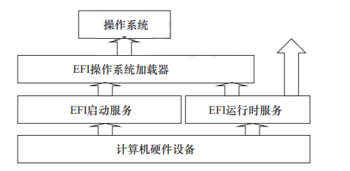
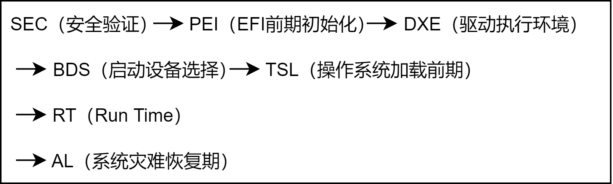
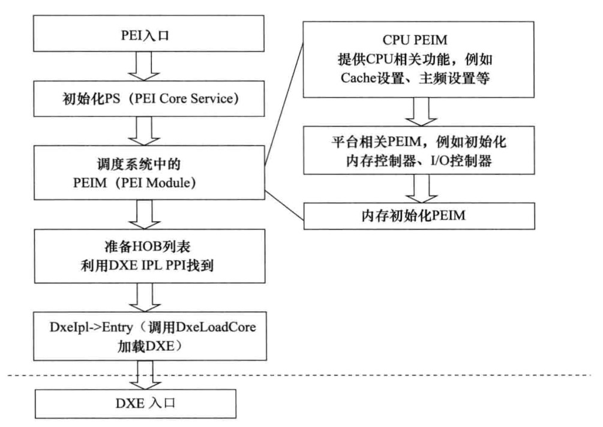
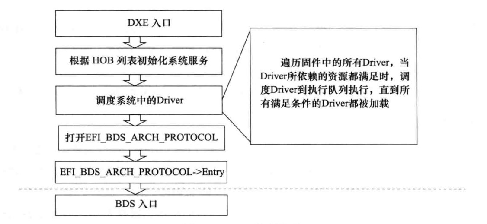

# UEFI 系统启动

## UEFI 系统组成

UEFI 提供给操作系统的接口包括启动服务（Boot Service）和运行时服务（Runtime Service）及隐藏在 BS 之后的丰富的 Protocol。BS 和 RT 以表的形式（类似 C 语言中的结构体）存在。UEFI 驱动和服务以 Protocol 的形式通过 BS 提供给操作系统。

下图为 EFI 系统组成。

> 图片来源：<https://www.eet-china.com/mp/a54075.html>。

1. 操作系统加载器（OS Loader）被加载；

2. OS Loader 执行 `ExitBootServices()`。

从 1->2 的过程是 UEFI 环境向操作系统过渡的过程，在此过程中，OS Loader 可通过 BS 和 RT 使用 UEFI 提供的服务，将计算机资源逐渐从 UEFI 转至操作系统，该过程被成为 TSL（Transient System Load）。

当 OS Loader 完全掌握计算机系统资源时，BS 便完成了其使命。OS Loader 调用 `ExitBootServices()` 结束 BS 并回收 BS 占用的资源。计算机系统进入 UEFI RT 阶段。在 RT 阶段只有 RT 继续为 OS 服务，BS 已经被计算机系统销毁。

在 TSL 阶段系统通过 BS 管理系统资源，此时 BS 提供的服务有：

- 事件服务：事件是异步操作的基础。有了事件的支持，才可以在 UEFI 系统内执行**并发**操作。

- 内存管理：主要提供内存的分配与释放，管理系统的内存映射。

- Protocol 管理：提供安装 Protocol 和卸载 Procotol 服务，以及注册 Protocol 通知函数（该函数会在 Protocol 安装时调用）的服务。

- Protocol 使用类服务：包括 Protocol 的打开与关闭，查找支持 Protocol 的控制器。比如需要读写某个 PCI 设备的寄存器，可通过 OpenProtocol 服务打开该设备上的 PciIo Protocol，用 `PciIo->Io.Read()` 服务读取该设备上的寄存器。

- 驱动管理：包括用于将驱动安装到控制器的 connect 服务，以及将驱动从控制器上卸载的 disconnect 服务。例如，启动时需要网络支持，则可以通过 loadImage 将驱动加载到内存，然后通过 connect 服务将驱动安装到设备。

- Image 管理：此类服务包括加载、卸载、启动和推出 UEFI 应用程序或驱动。

- ExitBootServices：用于结束启动服务，注销 BS。

RT 提供的服务有：

- 事件服务：读取/设定系统时间。读取/设定系统从睡眠中唤醒的时间。

- 读写 UEFI 系统变量：读取/设定系统变量。例如 BootLoader 用于指定启动项顺序，通过这些系统变量可以保存系统配置。

- 虚拟内存服务：将物理地址转换为虚拟地址。

- 其他服务：重启系统的 ResetSystem，获取系统提供的下一个单调单增值。

## UEFI 系统启动过程

UEFI 系统从加电到关机可分为 7 个阶段：

前三个阶段是 UEFI 初始化阶段，DEX 阶段结束后 UEFI 环境已经准备完毕。

BDS 和 TSL 是 OS Loader 作为 UEFI 应用程序运行的阶段。

OS Loader 调用 `ExitBootServices()` 服务后进入 RT 阶段，RT 阶段包括操作系统加载器后期和操作系统运行期。

当系统硬件或 OS 出现严重错误不能继续正常运行时，固件会尝试修复错误，这时系统会进入 AL 期。但 PI 规范和 UEFI 规范都没有规定 AL 期的行为。AL 期的系统行为有系统供应商自行定义。

> 图片来源：<https://www.codenong.com/cs106097735/>

### SEC 阶段

SEC（Security Phase）阶段是平台初始化的第一个阶段，计算机系统加电后进入这个阶段。

#### SEC 阶段的功能

1. 接收并处理系统启动和重启信号：系统加电信号、系统重启信号、系统运行过程中的严重异常信号。

2. 初始化临时存储区域：系统运行在 SEC 阶段时，仅 CPU 和 CPU 内部资源被初始化，而各种外部设备和内存都没有被初始化。因此系统需要一部分临时内存用于代码和数据的存储，一般称为临时 RAM，临时 RAM 只能位于 CPU 内部（CPU 和 CPU 内部资源最先被初始化）。最常用的临时 RAM 是 Cache，通常将 Cache 设置为 `no-eviction` 模式，将其当成内存使用，读命中时返回 Cache 中的数据，读缺失时不会向主存发出缺失事件，这种技术称为 CAR（Cache As RAM）。

3. 作为可信系统的根：作为系统启动的第一部分，SEC 阶段是整个可信系统的根。SEC 能被系统信任，以后的各个阶段才有被信任的基础。通常，SEC 在将控制权转移给 PEI 之前，可以验证 PEI。

4. 传递系统参数给下一阶段（即 PEI）：SEC 阶段的一切工作都是为 PEI 阶段做准备，最终 SEC 要把控制权转交给 PEI，同时要将 SEC 阶段的运行信息汇报给 PEI。SEC 通过将以下信息作为参数传递给 PEI 的入口程序来向 PEI 汇报信息：

    - 系统当前状态，PEI 根据状态值判断系统当前的健康情况。

    - 可启动固件（Boot Firmware Volume）的地址和大小。

    - 临时 RAM 区域的地址和大小。

    - 栈的地址和大小。

#### SEC 阶段执行流程

> 图片来源：<https://www.codenong.com/cs106097735/>

根据临界 RAM 初始化为界，SEC 的执行分为两大部分：临时 RAM 生效之前称为 Reset Vector 阶段，临时 RAM 生效后调用 SEC 入口函数从而进入 SEC 功能区。

其中 Reset Vector 执行流程如下：

1. 进入固件入口。

2. 从实模式转换到 32 位平坦模式（包含模式）。

3. 定位固件中的 BFV（Boot Firmware Volume）。

4. 定位 BFV 中的 SEC 影响。

5. 若是 64 位系统，从 32 位模式转换到 64 位模式。

6. 调用 SEC 入口函数。

在 Reset Vector 部分，因为系统还没有 RAM，因而不能使用基于栈的程序设计，所有的函数调用都使用 jmp 指令模拟。

进入 SEC 功能区后，首先利用 CAR 技术初始化栈，初始化 IDT，初始化 `EFI_SEC_PEI_HEAD_OFF`，将控制权转交给 PEI，并将 `EFI_SEC_PEI_HAND_OFF` 传递给 PEI。

### PEI 阶段

PEI（Pre-EFI Initialization）阶段资源仍然十分有限，内存到了 PEI 后期才被初始化，其主要功能是为 DXE 准备执行环境，将需要传递到 DXE 的信息组成 HOB（Hand Off Block）列表，最终将控制权转交到 DXE 手中。

PEI 从功能上可分为以下两部分：

- PEI 内核（PEI Foundation）：负责 PEI 基础服务和流程。

- PEIM（PEI Module）派遣器：主要功能时找出系统中的所有 PEIM，并根据 PEIM 之间的依赖关系按顺序执行 PEIM。PEI 阶段对系统的初始化主要是由 PEIM 完成。

每个 PEIM 都是一个独立的模块，通过 PeiServices，PEIM 可使用 PEI 阶段提供的系统服务，通过这些系统服务，PEIM 可访问 PEI 内核。PEIM 之间的通信通过 PPI（PEIM-to-PEIM Interface）完成。

> 图片来源：<https://www.codenong.com/cs106097735/>

1. 进入 PEI 入口。

2. 根据 SEC 阶段传入信息初始化 PS（PEI Core Service）。

3. 调度系统中的 PEIM（PEI Module）。具体调用的系统中的 PEIM 有：CPU PEIM（提供 CPU 相关功能，如进行 Cache 设置、主频设置等）；平台相关 PEIM（初始化内存控制器、I/O 控制器等）；内存初始化 PEIM（对内存进行初始化，此时内存才可用，之前使用的 CPU 模拟的临时内存）。

4. 准备 HOB 列表。

5. 调用 PEIServices 得到 DEX IPL PPI 的 Entry 服务（即 DEXLoadCore）。

6. DXELoadCore 服务找出并运行 DXEImage 的入口函数，将 HOB 列表传递给 DXE。

PPI 与 DEX 阶段的 Protocol 类似，每个 PPI 都是一个结构体，包含有函数指针和变量。每个 PPI 都有一个 GUID。通过 PEIServices 的 LocatePPI 服务可以找到 GUID 对应的 PPI 实例。

PEI 阶段执行流程完整描述：SEC 模块找到 PEI Image 的入口函数 _ModuleEntryPoint（该函数位于 `MdePkg/Library/PeimEntryPoint/PeimEntryPoint.c`），_ModuleEntryPoint 函数最终调用 PEI 模块的入口函数 PEICore（该函数位于 `MdeModulePkg/Core/Pei/PeiMain/PeiMain.c`），进入 PEICore 后，首先根据从 SEC 阶段出入的信息设置 PEI Core Services，然后调用 PEIDispatcher 执行系统总的 PEIM，在内存初始化完成后，系统切换栈并重新进入 PEICore。重新进入 PEICore 后使用的不再是 临时 RAM 而是真正的内存。在所有 PEIM 执行完成后，调用 PEIServices 的 LocatePPI 服务得到 DXE IPL PPI，并调用 DXE IPL PPI 的 Entry 服务（即 DEXLoadCore），找出 DEX Image 的入口函数，执行 DXE Image 函数并将 HOB 列表传递给 DXE。

### DXE 阶段

DXE (Driver Execution Environment) 阶段执行大部分系统初始化工作，进入此阶段时，内存已经可以被完全使用，因此该阶段可以执行大量复杂工作。从程序设计角度 DXE 阶段和 PEI 阶段相似。

DXE 从功能上可分为以下两部分：

- DXE 内核：负责 DXE 基础服务和执行流程。

  - 基础服务包括系统表、启动服务、Run Time Services。

- DXE 派遣器：负责调度执行 DXE 驱动，初始化系统设备。

  - 执行系统大部分初始化工作。

1. 从 DXE 入口进入 DXE 阶段。

2. 根据 HOB 列表初始化系统服务。

3. 调度系统中的 Driver。遍历固件中所有的 Driver，当 Driver 所依赖的资源得到满足时，调度 Driver 到执行队列执行，直到所有满足条件的 Driver 都被加载。

4. 打开 EFI_BDS_ARCH_PROTOCOL。

5. EFI_BDS_ARCH_PROTOCOL->Entry。

6. 从 BDS 入口进入 BDS 阶段。

每个 DEX 驱动是一个独立的模块，DEX 驱动之间通过 Protocol 通信。Protocol 是一种特殊的结构体，每个 Protocol 都有一个 GUID，通过系统 BootServices 的 OpenProtocol，可以根据 GUID 调用对应的 Protocol，从而使用这个 Protocol 提供的服务。

当所有的 Driver 都执行完成后，系统完成初始化，DEX 通过 EFI_BDS_ARCH_PROTOCOL 找到 BDS 并调用 BDS 的入口函数，从而进入 BDS 阶段。本质上说，BDS 是一种特殊的 DXE 阶段的应用程序。

### BDS 阶段

BDS（Boot Device Selection）的主要功能是执行启动策略。主要功能如下：

- 执行启动策略。

- 初始化控制台设备。

- 加载必要的设备驱动。

- 根据系统设置加载和执行启动项。

若加载启动项失败，系统将重新执行 DXE dispatcher 以加载更多的驱动，然后重新尝试加载启动项。

BDS 策略通过全局 NVRAM 变量配置，这些变量可以被运行时服务的 `GetVariable()` 读取，通过 `SetVariable()` 设置。例如 BootOrder 定义了启动顺序，变量 Boot#### 定义各个启动项（#### 为 4 个十六进制大写符号）。

当用户选中某个启动项（或进入系统默认启动项）后，OS Loader 启动，系统进入 TSL 阶段。

### TSL 阶段

TSL 阶段是 OS Loader 执行的第一阶段，这一阶段 OS Loader 作为一个 UEFI 应用程序运行，系统资源仍然由 UEFI 内核控制。当启动服务的 `ExitBootServices()` 服务被调用后，系统将进入 RT 阶段。

TSL 阶段之所以称为临时系统，原因在于其存在的目的是为 OS Loader 准备执行环境。虽然是临时系统，但已经具备操作系统的雏形，UEFI Shell 是这个临时系统的人机交互界面。正常运行中，系统不会进入 UEFI Shell，而是直接执行 OS Loader，只有在用户干预或是操作系统加载器出现严重问题时才会进入 UEFI Shell。

### RT 阶段

系统进入 RT 阶段后，系统控制权从 UEFI 内核转交至 OS Loader，UEFI 占用的各种资源被回收至 OS Loader。随着 OS Loader 的继续执行，操作系统完全取得对系统的控制。

### AL 阶段

在 RT 阶段如果系统（硬件或是软件）遇到灾难性错误，系统固件需要提供错误处理以及灾难恢复机制，这种机制运行在 AL（After Life）阶段。UEFI 和 UEFI PI 均未对 AL 阶段的行为和规范进行定义。

## 常用术语及简略词

| 缩略词 | 全名 | 描述 |
| --- | --- | --- |
| BIOS | Basic Input Output System | 基本输入输出系统 |
| UEFI | Unified Extensible Firmware Interface |  统一可扩展固件接口 |
| BS | Boot Services | 启动服务 |
| RT | Runtime Service | 运行时服务 |
| OS Loader | Operate System Loader | 操作系统加载器 |
| SEC | Security Phase | 安全阶段 |
| PEI | Pre-EFI Initialization | 预先 EFI 初始化 |
| DXE | Driver Execution Environment | 执行驱动配置环境 |
| BDS | Boot Device Select | 选择启动设备 |
| TSL | Transient System Load | 瞬态系统负载 |

## 参考

<https://www.eet-china.com/mp/a54075.html>

<https://www.codenong.com/cs106097735/>
