# UEFI 系统启动

## UEFI 系统组成

UEFI 提供给操作系统的接口包括启动服务（Boot Service）和运行时服务（Runtime Service）及隐藏在 BS 之后的丰富的 Protocol。BS 和 RT 以表的形式（类似 C 语言中的结构体）存在。UEFI 驱动和服务以 Protocol 的形式通过 BS 提供给操作系统。

下图为 EFI 系统组成。


> 图片来源：<https://www.eet-china.com/mp/a54075.html>。

1. 操作系统加载器（OS Loader）被加载；

2. OS Loader 执行 `ExitBootServices()`。

从 1->2 的过程是 UEFI 环境向操作系统过渡的过程，在此过程中，OS Loader 可通过 BS 和 RT 使用 UEFI 提供的服务，将计算机资源逐渐从 UEFI 转至操作系统，该过程被成为 TSL（Transient System Load）。

当 OS Loader 完全掌握计算机系统资源时，BS 便完成了其使命。OS Loader 调用 `ExitBootServices()` 结束 BS 并回收 BS 占用的资源。计算机系统进入 UEFI RT 阶段。在 RT 阶段只有 RT 继续为 OS 服务，BS 已经被计算机系统销毁。

在 TSL 阶段系统通过 BS 管理系统资源，此时 BS 提供的服务有：

- 事件服务：事件是异步操作的基础。有了事件的支持，才可以在 UEFI 系统内执行**并发**操作。

- 内存管理：主要提供内存的分配与释放，管理系统的内存映射。

- Protocol 管理：提供安装 Protocol 和卸载 Procotol 服务，以及注册 Protocol 通知函数（该函数会在 Protocol 安装时调用）的服务。

- Protocol 使用类服务：包括 Protocol 的打开与关闭，查找支持 Protocol 的控制器。比如需要读写某个 PCI 设备的寄存器，可通过 OpenProtocol 服务打开该设备上的 PciIo Protocol，用 `PciIo->Io.Read()` 服务读取该设备上的寄存器。

- 驱动管理：包括用于将驱动安装到控制器的 connect 服务，以及将驱动从控制器上卸载的 disconnect 服务。例如，启动时需要网络支持，则可以通过 loadImage 将驱动加载到内存，然后通过 connect 服务将驱动安装到设备。

- Image 管理：此类服务包括加载、卸载、启动和推出 UEFI 应用程序或驱动。

- ExitBootServices：用于结束启动服务，注销 BS。

RT 提供的服务有：

- 事件服务：读取/设定系统时间。读取/设定系统从睡眠中唤醒的时间。

- 读写 UEFI 系统变量：读取/设定系统变量。例如 BootLoader 用于指定启动项顺序，通过这些系统变量可以保存系统配置。

- 虚拟内存服务：将物理地址转换为虚拟地址。

- 其他服务：重启系统的 ResetSystem，获取系统提供的下一个单调单增值。

## UEFI 系统启动过程

UEFI 系统从加电到关机可分为 7 个阶段：


前三个阶段是 UEFI 初始化阶段，DEX 阶段结束后 UEFI 环境已经准备完毕。

BDS 和 TSL 是 OS Loader 作为 UEFI 应用程序运行的阶段。

OS Loader 调用 `ExitBootServices()` 服务后进入 RT 阶段，RT 阶段包括操作系统加载器后期和操作系统运行期。

当系统硬件或 OS 出现严重错误不能继续正常运行时，固件会尝试修复错误，这时系统会进入 AL 期。但 PI 规范和 UEFI 规范都没有规定 AL 期的行为。AL 期的系统行为有系统供应商自行定义。

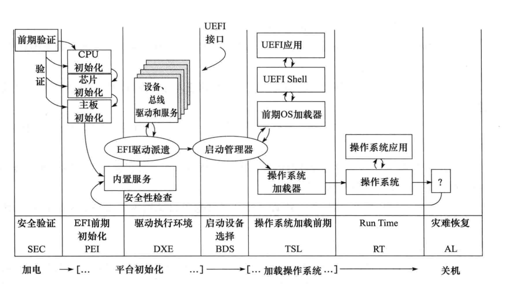

> 图片来源：<https://www.codenong.com/cs106097735/>

### SEC 阶段

SEC（Security Phase）阶段是平台初始化的第一个阶段，计算机系统加电后进入这个阶段。

#### SEC 阶段的功能

1. 接收并处理系统启动和重启信号：系统加电信号、系统重启信号、系统运行过程中的严重异常信号。

2. 初始化临时存储区域：系统运行在 SEC 阶段时，仅 CPU 和 CPU 内部资源被初始化，而各种外部设备和内存都没有被初始化。因此系统需要一部分临时内存用于代码和数据的存储，一般称为临时 RAM，临时 RAM 只能位于 CPU 内部（CPU 和 CPU 内部资源最先被初始化）。最常用的临时 RAM 是 Cache，通常将 Cache 设置为 `no-eviction` 模式，将其当成内存使用，读命中时返回 Cache 中的数据，读缺失时不会向主存发出缺失事件，这种技术称为 CAR（Cache As RAM）。

3. 作为可信系统的根：作为系统启动的第一部分，SEC 阶段是整个可信系统的根。SEC 能被系统信任，以后的各个阶段才有被信任的基础。通常，SEC 在将控制权转移给 PEI 之前，可以验证 PEI。

4. 传递系统参数给下一阶段（即 PEI）：SEC 阶段的一切工作都是为 PEI 阶段做准备，最终 SEC 要把控制权转交给 PEI，同时要将 SEC 阶段的运行信息汇报给 PEI。SEC 通过将以下信息作为参数传递给 PEI 的入口程序来向 PEI 汇报信息：

    - 系统当前状态，PEI 根据状态值判断系统当前的健康情况。

    - 可启动固件（Boot Firmware Volume）的地址和大小。

    - 临时 RAM 区域的地址和大小。

    - 栈的地址和大小。

#### SEC 阶段执行流程

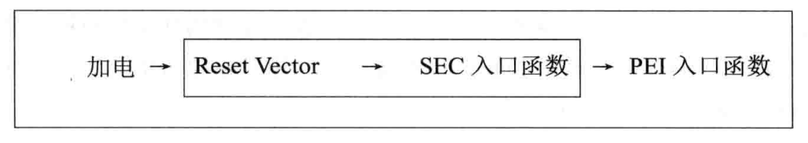

> 图片来源：<https://www.codenong.com/cs106097735/>

根据临界 RAM 初始化为界，SEC 的执行分为两大部分：临时 RAM 生效之前称为 Reset Vector 阶段，临时 RAM 生效后调用 SEC 入口函数从而进入 SEC 功能区。

其中 Reset Vector 执行流程如下：

1. 进入固件入口。

2. 从实模式转换到 32 位平坦模式（包含模式）。

3. 定位固件中的 BFV（Boot Firmware Volume）。

4. 定位 BFV 中的 SEC 影响。

5. 若是 64 位系统，从 32 位模式转换到 64 位模式。

6. 调用 SEC 入口函数。

在 Reset Vector 部分，因为系统还没有 RAM，因而不能使用基于栈的程序设计，所有的函数调用都使用 jmp 指令模拟。

进入 SEC 功能区后，首先利用 CAR 技术初始化栈，初始化 IDT，初始化 `EFI_SEC_PEI_HEAD_OFF`，将控制权转交给 PEI，并将 `EFI_SEC_PEI_HAND_OFF` 传递给 PEI。

### PEI 阶段

PEI（Pre-EFI Initialization）阶段资源仍然十分有限，内存到了 PEI 后期才被初始化，其主要功能是为 DXE 准备执行环境，将需要传递到 DXE 的信息组成 HOB（Hand Off Block）列表，最终将控制权转交到 DXE 手中。

PEI 从功能上可分为以下两部分：

- PEI 内核（PEI Foundation）：负责 PEI 基础服务和流程。

- PEIM（PEI Module）派遣器：主要功能时找出系统中的所有 PEIM，并根据 PEIM 之间的依赖关系按顺序执行 PEIM。PEI 阶段对系统的初始化主要是由 PEIM 完成。

每个 PEIM 都是一个独立的模块，通过 PeiServices，PEIM 可使用 PEI 阶段提供的系统服务，通过这些系统服务，PEIM 可访问 PEI 内核。PEIM 之间的通信通过 PPI（PEIM-to-PEIM Interface）完成。


> 图片来源：<https://www.codenong.com/cs106097735/>

1. 进入 PEI 入口。

2. 根据 SEC 阶段传入信息初始化 PS（PEI Core Service）。

3. 调度系统中的 PEIM（PEI Module）。具体调用的系统中的 PEIM 有：CPU PEIM（提供 CPU 相关功能，如进行 Cache 设置、主频设置等）；平台相关 PEIM（初始化内存控制器、I/O 控制器等）；内存初始化 PEIM（对内存进行初始化，此时内存才可用，之前使用的 CPU 模拟的临时内存）。

4. 准备 HOB 列表。

5. 调用 PEIServices 得到 DEX IPL PPI 的 Entry 服务（即 DEXLoadCore）。

6. DXELoadCore 服务找出并运行 DXEImage 的入口函数，将 HOB 列表传递给 DXE。

PPI 与 DEX 阶段的 Protocol 类似，每个 PPI 都是一个结构体，包含有函数指针和变量。每个 PPI 都有一个 GUID。通过 PEIServices 的 LocatePPI 服务可以找到 GUID 对应的 PPI 实例。

PEI 阶段执行流程完整描述：SEC 模块找到 PEI Image 的入口函数 _ModuleEntryPoint（该函数位于 `MdePkg/Library/PeimEntryPoint/PeimEntryPoint.c`），_ModuleEntryPoint 函数最终调用 PEI 模块的入口函数 PEICore（该函数位于 `MdeModulePkg/Core/Pei/PeiMain/PeiMain.c`），进入 PEICore 后，首先根据从 SEC 阶段出入的信息设置 PEI Core Services，然后调用 PEIDispatcher 执行系统总的 PEIM，在内存初始化完成后，系统切换栈并重新进入 PEICore。重新进入 PEICore 后使用的不再是临时 RAM 而是真正的内存。在所有 PEIM 执行完成后，调用 PEIServices 的 LocatePPI 服务得到 DXE IPL PPI，并调用 DXE IPL PPI 的 Entry 服务（即 DEXLoadCore），找出 DEX Image 的入口函数，执行 DXE Image 函数并将 HOB 列表传递给 DXE。

```c
/**
  This routine is invoked by main entry of PeiMain module during transition
  from SEC to PEI. After switching stack in the PEI core, it will restart
  with the old core data.

  @param SecCoreDataPtr  Points to a data structure containing information about the PEI core's operating
                         environment, such as the size and location of temporary RAM, the stack location and
                         the BFV location.
  @param PpiList         Points to a list of one or more PPI descriptors to be installed initially by the PEI core.
                         An empty PPI list consists of a single descriptor with the end-tag
                         EFI_PEI_PPI_DESCRIPTOR_TERMINATE_LIST. As part of its initialization
                         phase, the PEI Foundation will add these SEC-hosted PPIs to its PPI database such
                         that both the PEI Foundation and any modules can leverage the associated service
                         calls and/or code in these early PPIs
  @param Data            Pointer to old core data that is used to initialize the
                         core's data areas.
                         If NULL, it is first PeiCore entering.
**/

VOID EFIAPI PeiCore (
  IN CONST EFI_SEC_PEI_HAND_OFF    *SecCoreDataPtr,
  IN CONST EFI_PEI_PPI_DESCRIPTOR  *PpiList,
  IN VOID                          *Data
  )

/* Initialize PEI Core Services */
  InitializeMemoryServices (&PrivateData, SecCoreData, OldCoreData);

/* Call PEIM dispatcher */
  PeiDispatcher (SecCoreData, &PrivateData);

/* Final service to be invoked by the PEI Foundation.
*  The DXE IPL PPI is responsible for locating and loading the DXE Foundation.
*  The DXE IPL PPI may use PEI services to locate and load the DXE Foundation.
*/
struct _EFI_DXE_IPL_PPI {
  EFI_DXE_IPL_ENTRY    Entry;
};
```

PEI Services Table
| Service | Functions |
| -- | -- |
| PPI | InstallPpi() NotifyPpi() LocatePpi() ReInstallPpi()|
| Boot Mode | GetBootMode() SetBootMode() |
| HOB | GetHobList() CreateHob() |
| Flash Volume(FV) | FfsFindNextVolume() FfsFindNextFile() FfsFindSectionData() |
| PEI Memory | InstallPeiMemory() CopyMem() AllocatePages() SetMem() AllocatePool() |
| Status Code | PeiReportStatusCode() |
| Reset | PeiResetSystem() |

- 对系统中的所有 PEIM 可见；

- 由于内存限制，PEI 期间创建的服务范围有限；

- 指向表的指针被传递到每个 PEIM 入口点和每个 PEIM-to-PEIM 接口（PPI）；

- PEI 服务表包括一个函数指针列表。该表位于 ROM 或内存中。

```c
/**
  Search the firmware volumes by index

  @param PeiServices     An indirect pointer to the EFI_PEI_SERVICES table published by the PEI Foundation
  @param Instance        This instance of the firmware volume to find. The value 0 is the Boot Firmware
                         Volume (BFV).
  @param VolumeHandle    On exit, points to the next volume handle or NULL if it does not exist.

  @retval EFI_INVALID_PARAMETER  VolumeHandle is NULL
  @retval EFI_NOT_FOUND          The volume was not found.
  @retval EFI_SUCCESS            The volume was found.

**/
EFI_STATUS EFIAPI PeiFfsFindNextVolume (
  IN CONST EFI_PEI_SERVICES  **PeiServices,
  IN UINTN                   Instance,
  IN OUT EFI_PEI_FV_HANDLE   *VolumeHandle
  );
```

PEIM 调度器代码位置 `/tianocore/edk2/MdeModulePkg/Core/Pei/Dispatcher/Dispatcher.c`。

```c
/**
  Conduct PEIM dispatch.

  @param SecCoreData     Pointer to the data structure containing SEC to PEI handoff data
  @param PrivateData     Pointer to the private data passed in from caller

**/
VOID PeiDispatcher (
  IN CONST EFI_SEC_PEI_HAND_OFF  *SecCoreData,
  IN PEI_CORE_INSTANCE           *PrivateData
  );
{
/* This is the main dispatch loop. It will search known FVs for PEIMs 
*  and attempt to dispatch them. 
*/
  do {
  
    for (FvCount = Private->CurrentPeimFvCount; FvCount < Private->FvCount; FvCount++) {
      CoreFvHandle = FindNextCoreFvHandle (Private, FvCount);
  
      Private->CurrentPeimFvCount = FvCount;
  
      // Start to dispatch all modules within the current FV.
      for (PeimCount = Private->CurrentPeimCount;...) {
  
      // For PEIM driver, Load its entry point
      Status = PeiLoadImage (PeiServices, PeimFileHandle, PEIM_STATE_NOT_DISPATCHED, &EntryPoint, &AuthenticationState );
  
      // Call the PEIM entry point for PEIM driver
      PeimEntryPoint = (EFI_PEIM_ENTRY_POINT2)(UINTN)EntryPoint;
      PeimEntryPoint (PeimFileHandle, (const EFI_PEI_SERVICES **)PeiServices);
      } // end for
    } // end for
  } while (Private->PeimNeedingDispatch && Private->PeimDispatchOnThisPass);
}
```

SEC 到 PEI 的转换期间，PeiMain 模块的主入口调用代码位置 `/tianocore/edk2/MdeModulePkg/Core/Pei/PeiMain/PeiMain.c`。

```c
/**
  This routine is invoked by main entry of PeiMain module during transition
  from SEC to PEI. After switching stack in the PEI core, it will restart
  with the old core data.
**/
VOID EFIAPI PeiCore (
  IN CONST EFI_SEC_PEI_HAND_OFF    *SecCoreDataPtr,
  IN CONST EFI_PEI_PPI_DESCRIPTOR  *PpiList,
  IN VOID                          *Data
  )

  // Lookup DXE IPL PPI
  Status = PeiServicesLocatePpi ( &gEfiDxeIplPpiGuid, 0, NULL, (VOID **)&TempPtr.DxeIpl);

  // Enter DxeIpl to load Dxe core.
  DEBUG ((DEBUG_INFO, "DXE IPL Entry\n"));
  Status = TempPtr.DxeIpl->Entry (TempPtr.DxeIpl, &PrivateData.Ps, PrivateData.HobList);

  // Should never reach here.
  ASSERT_EFI_ERROR (Status);
  CpuDeadLoop ();
```

向 DXE Core 转移控制代码位置 `/tianocore/edk2/OvmfPkg/Library/PeilessStartupLib/DxeLoad.c`。

```c

/* Transfer control to the DXE Core
*  The hand off state is simply a pointer to the HOB list
*/
  HandOffToDxeCore (DxeCoreEntryPoint);
```

### DXE 阶段

DXE (Driver Execution Environment) 阶段执行大部分系统初始化工作，进入此阶段时，内存已经可以被完全使用，因此该阶段可以执行大量复杂工作。从程序设计角度 DXE 阶段和 PEI 阶段相似。

DXE 从功能上可分为以下两部分：

- DXE 内核：负责 DXE 基础服务和执行流程。

  - 基础服务包括系统表、启动服务、Run Time Services。

- DXE 派遣器：负责调度执行 DXE 驱动，初始化系统设备。

  - 执行系统大部分初始化工作。


1. 从 DXE 入口进入 DXE 阶段。

2. 根据 HOB 列表初始化系统服务。

3. 调度系统中的 Driver。遍历固件中所有的 Driver，当 Driver 所依赖的资源得到满足时，调度 Driver 到执行队列执行，直到所有满足条件的 Driver 都被加载。

4. 打开 EFI_BDS_ARCH_PROTOCOL。

5. EFI_BDS_ARCH_PROTOCOL->Entry。

6. 从 BDS 入口进入 BDS 阶段。

每个 DEX 驱动是一个独立的模块，DEX 驱动之间通过 Protocol 通信。Protocol 是一种特殊的结构体，每个 Protocol 都有一个 GUID，通过系统 BootServices 的 OpenProtocol，可以根据 GUID 调用对应的 Protocol，从而使用这个 Protocol 提供的服务。

当所有的 Driver 都执行完成后，系统完成初始化，DEX 通过 EFI_BDS_ARCH_PROTOCOL 找到 BDS 并调用 BDS 的入口函数，从而进入 BDS 阶段。本质上说，BDS 是一种特殊的 DXE 阶段的应用程序。

#### DXE 基础功能（DXE Foundation's Function）

DXE 基础功能是 DXE 阶段的核心。

- 初始化平台；
- 调度 DXE；
- 调度 UEFI；
- 加载启动管理器。

#### DXE 基础属性

DXE 基础有以下属性。

- HOB 列表依赖（HOB-List Dependent）；
- 没有硬件细节（No Handware Specifics）；
- 没有硬编码地址（No Hard-Code Addresses）。

#### DXE 组件（DXE Components）

DXE 阶段有几个组件，类似于 PEI 阶段的组件。

- 驱动（Drivers）；
- 基础（Foundation）；
- 调度（Dispatcher）；
- 架构协议（Architectural Protocols）；
- UEFI 系统表（UEFI System Table）。

#### PEI 到 DXE 入口（PEI To DXE Entry）


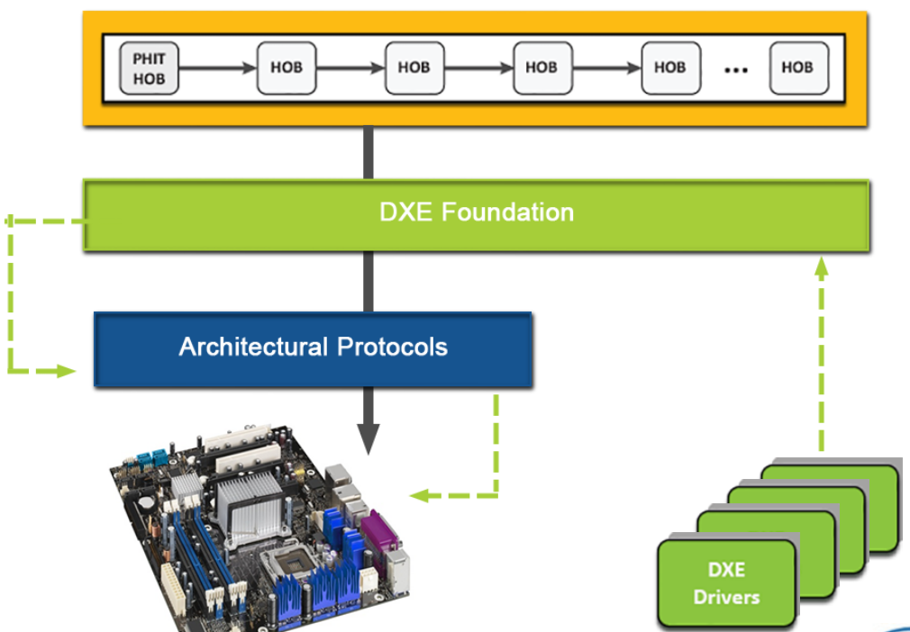

#### DXE 阶段流（DXE Phase Flow）

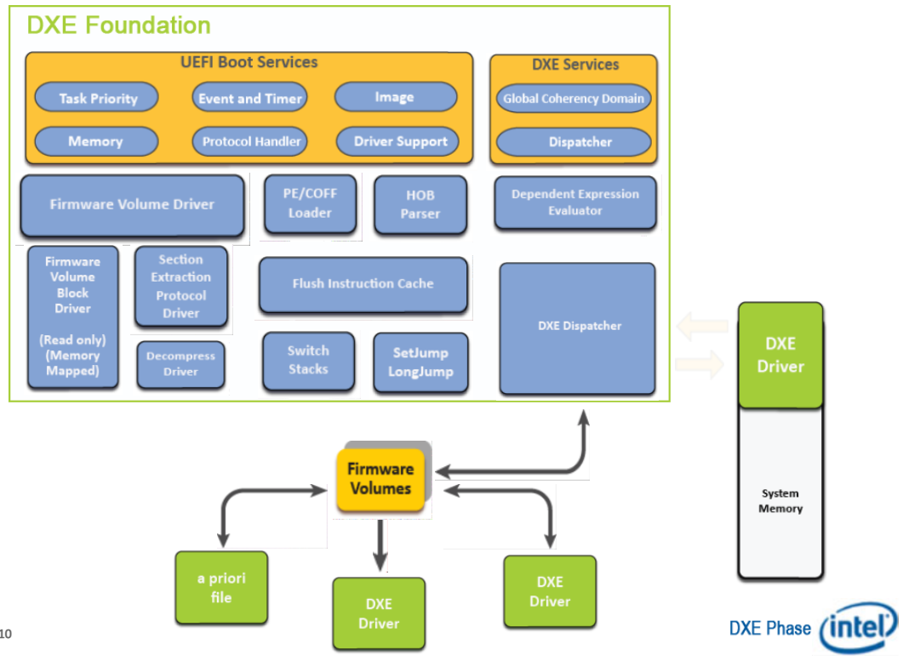

#### EFI 系统表（EFI System Table）

EFI 系统表是指向系统中所有数据结构的指针。

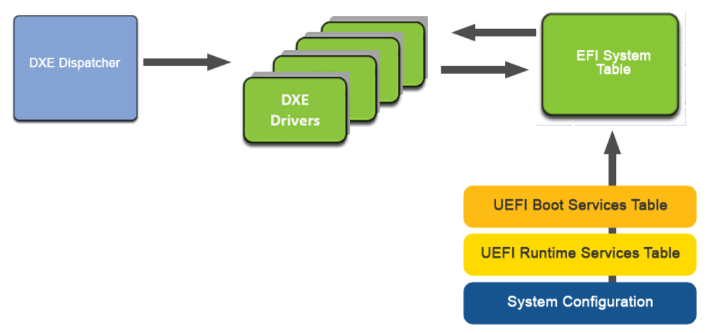

##### DXE 基础数据结构（DXE Foundation Data Structures）

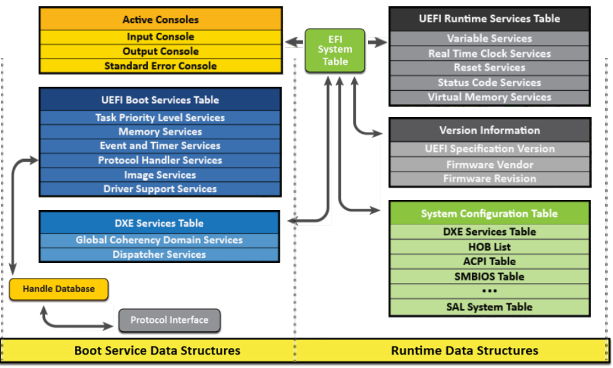

#### 事件（Events）

事件是一种向其他对象发出信号的消息传递方法，例如协议。UEFI 使用事件代替中断，因为事件独立于处理器体系结构。

#### DXE 基础代码流程（DXE Foundaion Code Flow）

代码流负责在 DXE 基础中移动。DXE 基础代码流有两个属性：单线程环境和一个中断。

- 单线程环境（Single Threaded Environment）
  - 引导程序处理器（BSP）是唯一通过 DXE 基础代码移动的进程；
  - 所有应用程序处理器都处于等待模式；
- 一个中断（One Interrupt）
  - DXE Foundation 将计时器滴答作为其唯一的软件中断；
  - 由于定时器中断是唯一使用的，您可以推断所有设备都被轮询；
  - DXE Foundation 使用事件代替多中断。

#### DXE Main

DXE Main 是 EDK II 实现的官方函数调用。主要负责以下事项：

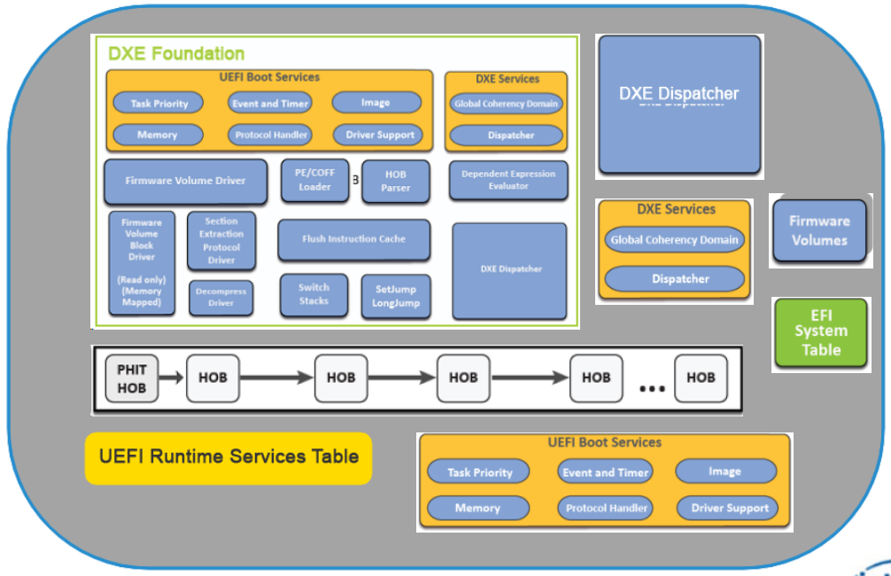

DXE Main 代码位置在 `tianocore/edk2/MdeModulePkg/Core/Dxe/DxeMain/DxeMain.c`。

```c
/**
  Main entry point to DXE Core.

  @param  HobStart               Pointer to the beginning of the HOB List from PEI.

  @return This function should never return.
**/
VOID EFIAPI DxeMain (
  IN  VOID  *HobStart
  )
{
  // Initialize
  // Initialize Memory Services
  CoreInitializeMemoryServices (&HobStart, &MemoryBaseAddress, &MemoryLength);

  // Invoke the DXE Dispatcher
  CoreDispatcher ();

  // Transfer control to the BDS Architectural Protocol
  gBds->Entry (gBds);

  // BDS should never return
  ASSERT (FALSE);
  CpuDeadLoop ();
}
```

#### 架构协议（Architectural Protocols）

DXE 驱动程序生成架构协议以从硬件中抽象 DXE。

- 功能
  - AP 充当隔离特定于平台的硬件的包装函数。CPU AP 管理中断、检索处理器信息并查询基于处理器的计时器；
- 支持
  - AP 是支持引导和运行时服务的低级协议，AP 通过调用更高级别的平台功能来提供支持；
- 依赖
  - 一些 AP 需要依赖于其他 AP。例如，看门狗定时器需要 IO 和定时器访问；
  - 使用以下方法之一来控制依赖加载顺序：
    - 依赖语法以正确的顺序加载 DXE；
    - `RegistryProtocolNotify()` 在加载 AP 时发出通知；
    - 优先级列表，它是固件卷中包含文件名 GUID 列表的文件。


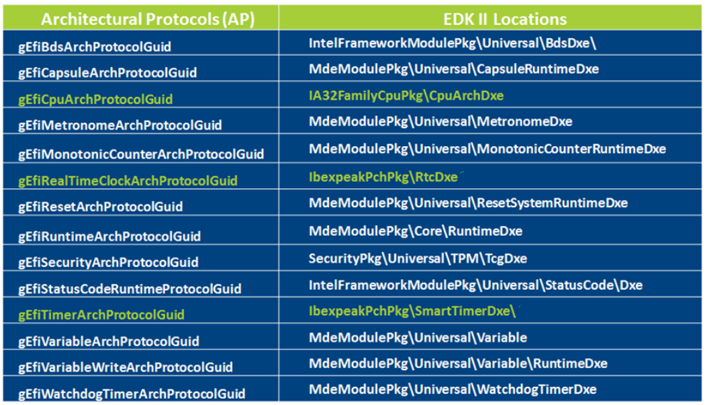

#### DXE 调度器（DXE Dispatcher）

DXE 调度器负责加载和调度在固件卷中发现的 DXE 和 UEFI 驱动程序。

DXE 调度器驱动入口为 `/tianocore/edk2/MdeModulePkg/Core/Dxe/Image/Image.c`。

```c
/**
  Transfer control to a loaded image's entry point.

  @param  ImageHandle             Handle of image to be started.
  @param  ExitDataSize            Pointer of the size to ExitData
  @param  ExitData                Pointer to a pointer to a data buffer that
                                  includes a Null-terminated string,
                                  optionally followed by additional binary data.
                                  The string is a description that the caller may
                                  use to further indicate the reason for the
                                  image's exit.

  @retval EFI_INVALID_PARAMETER   Invalid parameter
  @retval EFI_OUT_OF_RESOURCES    No enough buffer to allocate
  @retval EFI_SECURITY_VIOLATION  The current platform policy specifies that the image should not be started.
  @retval EFI_SUCCESS             Successfully transfer control to the image's
                                  entry point.
**/
EFI_STATUS EFIAPI CoreStartImage (
  IN EFI_HANDLE  ImageHandle,
  OUT UINTN      *ExitDataSize,
  OUT CHAR16     **ExitData  OPTIONAL
  )
{
  Image = CoreLoadedImageInfo (ImageHandle);
 
  // Call the image's entry point
  Image->Started = TRUE;
  Image->Status  = Image->EntryPoint (ImageHandle, Image->Info.SystemTable);

  // Add some debug information if the image returned with error.
  // This make the user aware and check if the driver image have already released
  // all the resource in this situation.
  DEBUG_CODE_BEGIN ();
  if (EFI_ERROR (Image->Status)) {
    DEBUG ((DEBUG_ERROR, "Error: Image at %11p start failed: %xr\n", Image->Info.ImageBase, Image->Status));
  }

return Status;
}
```

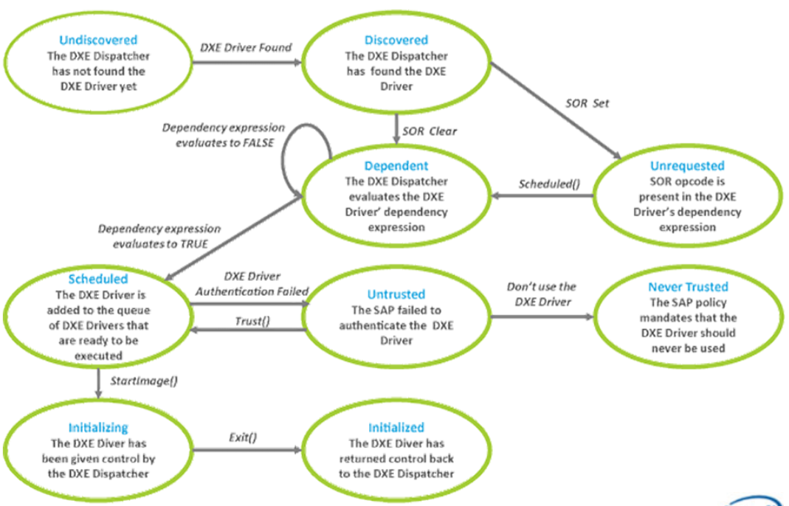

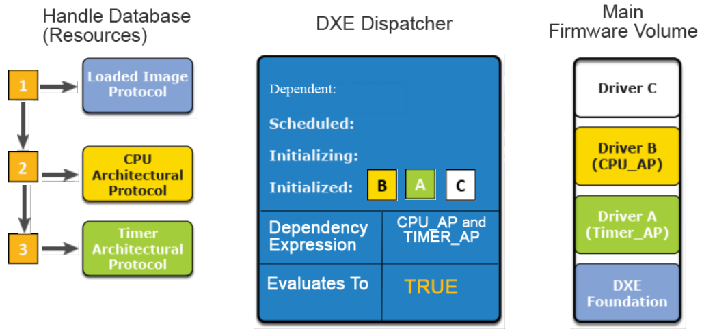

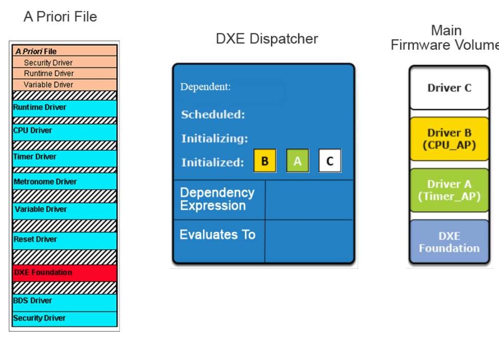

#### DXE 驱动

##### DXE 驱动类型

DXE 驱动程序是包含设备或服务代码的模块，在 UEFI 驱动程序之前执行。下面有两种 DXE 驱动类型：

- 早期 DXE 阶段驱动程序
  - 在 DXE 阶段首先执行；
  - 包含 DEPEX 来描述调度顺序；
  - 生产 APs;
  - 通常包含基本服务、平台初始化代码和处理器/芯片组初始化代码。
- UEFI 驱动
  - 初始化时不与硬件交互；
  - 遵循 UEFI 驱动模型；
  - 提供对控制台和引导设备的访问；
  - 抽象总线控制器；
  - 仅初始化启动操作系统所需的驱动程序。

##### BDS 驱动

DXE 调用的最后一个驱动程序是 BDS 驱动程序。BDS 驱动程序负责建立控制台（键盘、视频）和处理 UEFI 引导选项。

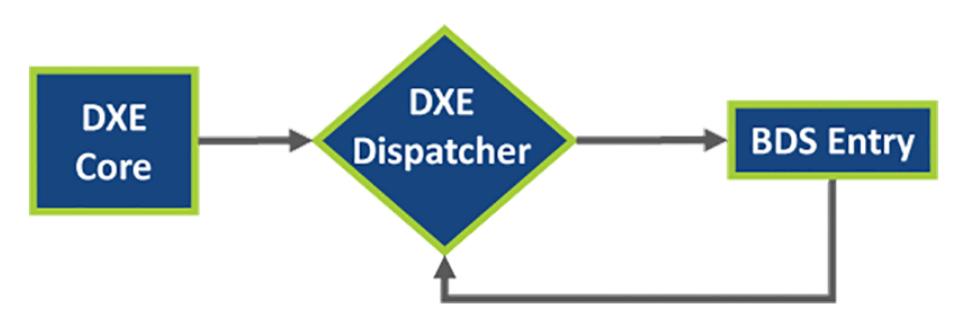

#### 系统管理模式（SMM）

SMM 服务是一种高优先级 SMI，它控制系统，包括在运行时。SMM 服务的基础设施是在 DXE 阶段建立的。

- 特征
  - 在 SMI 上，处理器从一个已知的、预定义的起始向量执行；
  - SMM 代码驻留在一个特殊的位置（SMRAM），并在 SMM 代码初始化后被锁定；
  - SMI 由硬件事件或系统中断生成，可以被检测到并被清除和禁用。
- 服务
  - SMM 服务是一个处理程序列表，是 DXE 基础服务的一个子集；
  - SMM 服务和 DXE Foundation 服务提供相同的功能，但位于不同的位置。SMM 服务位于 SMRAM 中。

### BDS 阶段

BDS（Boot Device Selection）的主要功能是执行启动策略。主要功能如下：

- 执行启动策略。

- 初始化控制台设备。

- 加载必要的设备驱动。

- 根据系统设置加载和执行启动项。

若加载启动项失败，系统将重新执行 DXE dispatcher 以加载更多的驱动，然后重新尝试加载启动项。

BDS 策略通过全局 NVRAM 变量配置，这些变量可以被运行时服务的 `GetVariable()` 读取，通过 `SetVariable()` 设置。例如 BootOrder 定义了启动顺序，变量 Boot#### 定义各个启动项（#### 为 4 个十六进制大写符号）。

当用户选中某个启动项（或进入系统默认启动项）后，OS Loader 启动，系统进入 TSL 阶段。

#### BDS 阶段的主要步骤

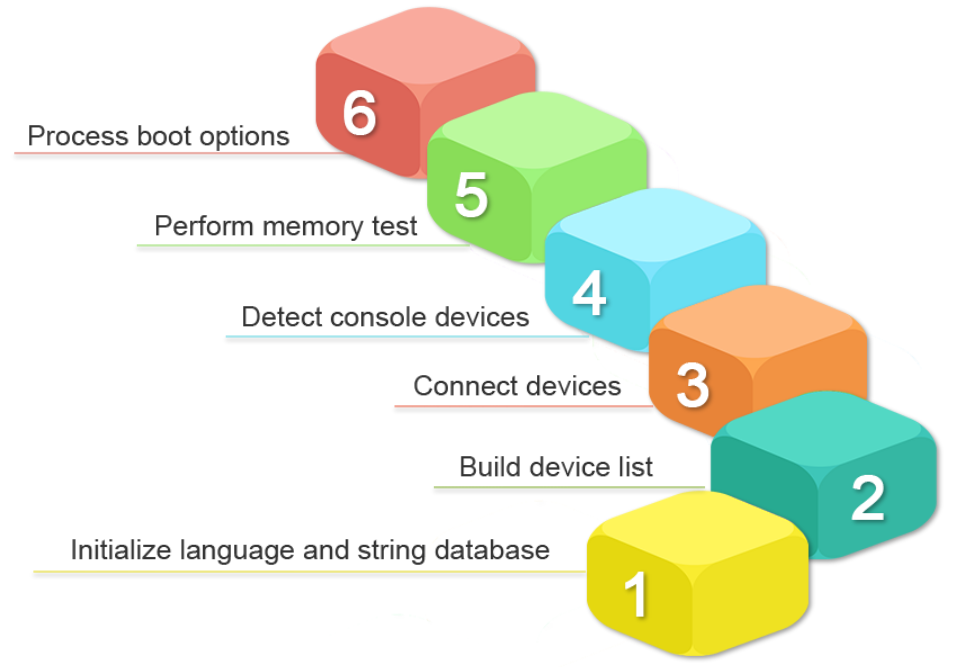

#### BDS 目标

- 集中策略和用户界面；
- 以最少的驱动程序初始化和用户交互启用引导；
- 为平台引导策略创建一个中央存储库；
- 允许实现菜单设置；

#### BDS 属性和功能

BDS 阶段有特定的属性和功能。

- BDS AP
  BDS 架构协议（AP）在 BDS 阶段执行。
  - APs 已在 handle 数据库中注册；
  - DXE 调度器发送了它的 DXE 和 UEFI 驱动程序列表。
  事实上，许多 OEM 供应商拦截 BDS 阶段以供他们自己实施。

- 控制
BDS 在平台初始化期间控制 DXE Foundation，并将该控制权传递给引导目标（硬盘驱动器、CD/ROM 等）。

- WatchDog

如果出现引导失败或用户干预，BDS 阶段将填充引导目标列表。引导目标与驱动程序一起存储在全局变量列表中。

如果其中一个引导目标未完全初始化或未在 DXE 阶段注册，BDS 将需要运行 DXE 服务来初始化这些引导目标。

- 用户界面/独立硬件供应商（IHV）

BDS 阶段的另一个属性是它为用户提供了一个设置菜单。在此阶段，将有机会调整设置、引导列表、引导列表维护、IHV 适配器配置、诊断和恢复。

OEM 选择公开什么以及如何满足给定市场中平台的业务需求。

- 引导目标

BDS 的一个选项是配备看门狗定时器以防止启动失败。

#### DXE 到 BDS 流程

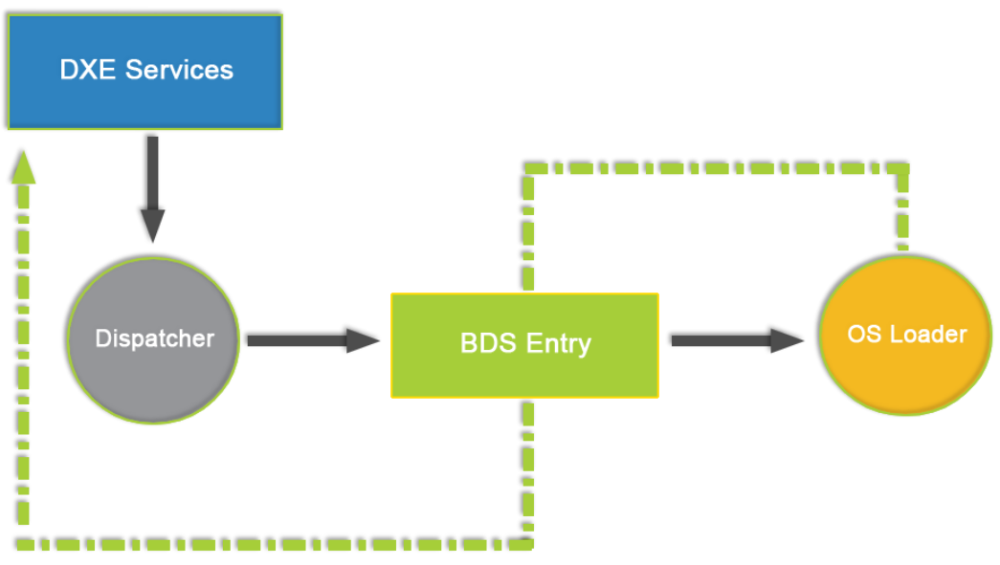

BDS 入口代码位置 `/tianocore/edk2/MdeModulePkg/Universal/BdsDxe/BdsEntry.c`。

```c
/**
  Service routine for BdsInstance->Entry(). Devices are connected, the
  consoles are initialized, and the boot options are tried.

  @param This             Protocol Instance structure.

**/
VOID EFIAPI BdsEntry (
  IN EFI_BDS_ARCH_PROTOCOL  *This
  )
```

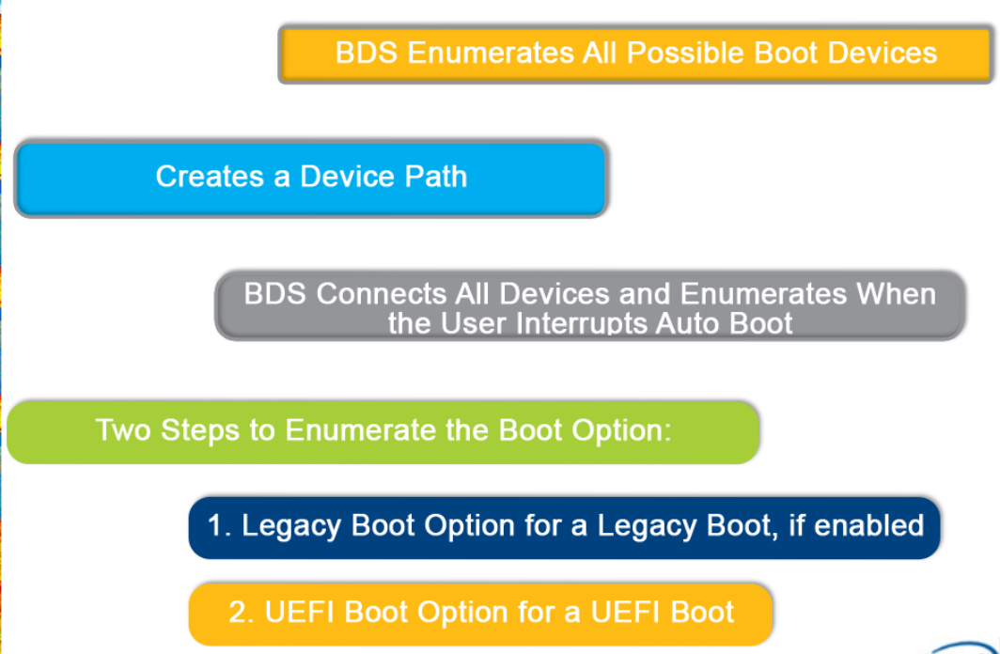

DXE 主调用 BDS 代码位置 `/tianocore/edk2/MdeModulePkg/Core/Dxe/DxeMain/DxeMain.c`。

```c
/**
  Main entry point to DXE Core.

  @param  HobStart               Pointer to the beginning of the HOB List from PEI.

  @return This function should never return.

**/
VOID EFIAPI DxeMain (
  IN  VOID  *HobStart
  )
{
  // Transfer control to the BDS Architectural Protocol
  gBds->Entry (gBds);

  // BDS should never return
  ASSERT (FALSE);
  CpuDeadLoop ();
}
```

### TSL 阶段

TSL 阶段是 OS Loader 执行的第一阶段，这一阶段 OS Loader 作为一个 UEFI 应用程序运行，系统资源仍然由 UEFI 内核控制。当启动服务的 `ExitBootServices()` 服务被调用后，系统将进入 RT 阶段。

TSL 阶段之所以称为临时系统，原因在于其存在的目的是为 OS Loader 准备执行环境。虽然是临时系统，但已经具备操作系统的雏形，UEFI Shell 是这个临时系统的人机交互界面。正常运行中，系统不会进入 UEFI Shell，而是直接执行 OS Loader，只有在用户干预或是操作系统加载器出现严重问题时才会进入 UEFI Shell。

### RT 阶段

系统进入 RT 阶段后，系统控制权从 UEFI 内核转交至 OS Loader，UEFI 占用的各种资源被回收至 OS Loader。随着 OS Loader 的继续执行，操作系统完全取得对系统的控制。

### AL 阶段

在 RT 阶段如果系统（硬件或是软件）遇到灾难性错误，系统固件需要提供错误处理以及灾难恢复机制，这种机制运行在 AL（After Life）阶段。UEFI 和 UEFI PI 均未对 AL 阶段的行为和规范进行定义。

## 常用术语及简略词

| 缩略词 | 全名 | 描述 |
| --- | --- | --- |
| BIOS | Basic Input Output System | 基本输入输出系统 |
| UEFI | Unified Extensible Firmware Interface |  统一可扩展固件接口 |
| BS | Boot Services | 启动服务 |
| RT | Runtime Service | 运行时服务 |
| OS Loader | Operate System Loader | 操作系统加载器 |
| SEC | Security Phase | 安全阶段 |
| PEI | Pre-EFI Initialization | 预先 EFI 初始化 |
| DXE | Driver Execution Environment | 执行驱动配置环境 |
| BDS | Boot Device Select | 选择启动设备 |
| TSL | Transient System Load | 瞬态系统负载 |
| FV | Flash Volume | 闪存卷 |
| FV | Firmware Volume | 固件卷 |
| T-RAM | Temporary Memory | 临时 RAM |
| PPI | PEIM-to-PEIM Interface | PEIM 到 PEIM 接口 |
| XIP | Execute In Place | 就地执行 |
| PEIM | PEI Module | PEI 模块 |
| GUID | Global Unique Identifier | 全局唯一标识符 |
| BFV | Boot Firmware Volume | 启动固件卷 |
| CAR | Cache as RAM | 缓存为 RAM |
| BNF | Backus Naur Form |  |
| OEM | Original Equipment Manufacturer-Provided | 原始设备制造商提供 |
| HOB | Hand-Off Block | 交接块 |
| BSP | Boot Strap Processor | 引导程序处理器 |
| PHIT | PEI Hand-Off Information Table | PEI 交接信息表 |
| IPL | Initial Program Load | 初始程序加载 |
| APs | Architectural Protocols | 架构协议 |
| SMM | System Management Mode | 系统管理模式 |
| SMI | System Management Interrupt | 系统管理中断 |
| NIC | Network Interface Controller | 网络接口控制器 |
| UNDI | Universial Network Driver Interface | 通用网络驱动程序接口 |
| NII | Network Interface Identifier | 网络接口标识符 |
| MNP | Managed Network Protocol | 托管网络协议 |
| SNP | Simple Network Protocol | 简单网络协议 |
| IHV | Independent Hardware Vendors | 独立硬件供应商 |

## 参考

<https://www.eet-china.com/mp/a54075.html>

<https://www.codenong.com/cs106097735/>
